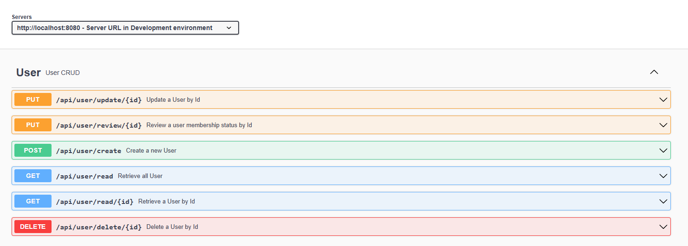
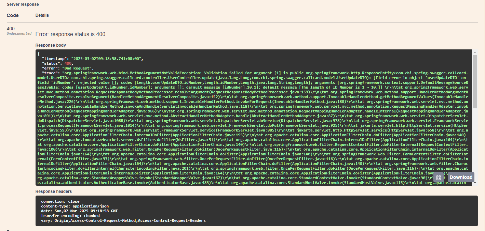

# 會員維護測試

- 申請日期我是讓他在申請及更新的時候都須填寫
- 會員編號的通路別及分公司我目前是直接寫死~
- 進件來源目前只有紙本，就沒有讓前端傳資料進來
- 會員狀態我有自己定義：VALID | INVALID | CANCELLED | DISABLED | APPROVED | UNDER_REVIEW | NOT_APPROVED
- 國籍代碼轉換我是用ISO 3166-1的二位字母代碼去查
- Swagger：http://localhost:8080/swagger-ui/index.html
- H2 Database：
  - JDBC URL：`jdbc:h2:file:./data/TestDataDB`
  - username：`sa`
  - password：`password`

## API 預覽：


## 會員資料申請
- 會員資料


- 回應結果


- Responses
```json
{
  "id": 1,
  "applicationDate": "2025-03-02T06:01:56.001+00:00",
  "recordDate": "2025-03-01T16:00:00.000+00:00",
  "membershipNumber": "1234114000001",
  "sourceOfSubmission": "紙本",
  "membershipStatus": "有效",
  "idNumber": "A123456789",
  "username": "Test01",
  "dateOfBirth": "2005-02-02T06:01:56.001+00:00",
  "nationality": "中華民國",
  "contactPhoneNumber": "02123456789",
  "mobilePhoneNumber": "09123456789",
  "postalCode": "11111",
  "correspondenceAddress": "台北市士林區",
  "email": "test@test.com",
  "isZodiacNotification": "Y",
  "isSelfInsurance": "Y",
  "isApplyForElectronicPolicy": "Y",
  "isMobileServiceConsentForm": "Y",
  "isInconvenienceInsurance": "Y",
  "remarks": "加入備註"
}
```
## 會員資料查詢
- 查詢剛剛新增的User，查詢ID：1


- Responses
```json
{
  "id": 1,
  "applicationDate": "2025-03-02",
  "recordDate": "2025-03-02",
  "membershipNumber": "1234114000001",
  "sourceOfSubmission": "紙本",
  "membershipStatus": "有效",
  "idNumber": "A123456789",
  "username": "Test01",
  "dateOfBirth": "2005-02-02",
  "nationality": "中華民國",
  "contactPhoneNumber": "02123456789",
  "mobilePhoneNumber": "09123456789",
  "postalCode": "11111",
  "correspondenceAddress": "台北市士林區",
  "email": "test@test.com",
  "isZodiacNotification": "Y",
  "isSelfInsurance": "Y",
  "isApplyForElectronicPolicy": "Y",
  "isMobileServiceConsentForm": "Y",
  "isInconvenienceInsurance": "Y",
  "remarks": "加入備註"
}
```
## 會員資料維護
- 修改剛剛新增的User，ID：1，修改姓名(測試01)、國籍(JP)、行動電話(09000000000)、生肖通知(N)


- 回應結果，指定修改資料順利修改


- Responses
```json
{
  "id": 1,
  "applicationDate": "2025-03-02T06:01:56.001+00:00",
  "recordDate": "2025-03-02",
  "membershipNumber": "1234114000001",
  "sourceOfSubmission": "紙本",
  "membershipStatus": "有效",
  "idNumber": "A123456789",
  "username": "測試01",
  "dateOfBirth": "2005-02-02",
  "nationality": "日本",
  "contactPhoneNumber": "02123456789",
  "mobilePhoneNumber": "09000000000",
  "postalCode": "11111",
  "correspondenceAddress": "台北市士林區",
  "email": "test@test.com",
  "isZodiacNotification": "N",
  "isSelfInsurance": "Y",
  "isApplyForElectronicPolicy": "Y",
  "isMobileServiceConsentForm": "Y",
  "isInconvenienceInsurance": "Y",
  "remarks": "加入備註"
}
```
- 再次查詢剛剛修改的User


## 會員資料覆核
- 覆核會員狀態，改為Invalid


- 回應結果，會員狀態已改為無效


- Responses
```json
{
  "id": 1,
  "applicationDate": "2025-03-02",
  "recordDate": "2025-03-02",
  "membershipNumber": "1234114000001",
  "sourceOfSubmission": "紙本",
  "membershipStatus": "無效",
  "idNumber": "A123456789",
  "username": "測試01",
  "dateOfBirth": "2005-02-02",
  "nationality": "日本",
  "contactPhoneNumber": "02123456789",
  "mobilePhoneNumber": "09000000000",
  "postalCode": "11111",
  "correspondenceAddress": "台北市士林區",
  "email": "test@test.com",
  "isZodiacNotification": "N",
  "isSelfInsurance": "Y",
  "isApplyForElectronicPolicy": "Y",
  "isMobileServiceConsentForm": "Y",
  "isInconvenienceInsurance": "Y",
  "remarks": "加入備註"
}
```

- 再次查詢剛剛覆核的User


## 會員資料刪除
- 刪除User，ID：1


- 回應結果


## 會員資料新增及修改規則

### 新增會員
- 錯誤內容
  1. 身分證為空
  2. 缺少姓名
  3. 郵遞區號超過6碼
  4. email格式不正確
  5. 生肖通知內容使用非Y/N

- 回應結果


- 回應錯誤訊息：[新增會員錯誤訊息](error-1.json)


### 更新會員
- 錯誤內容
    1. 身分證為空
- 回應結果

- 回應錯誤訊息：[更新會員錯誤訊息](error-2.json)